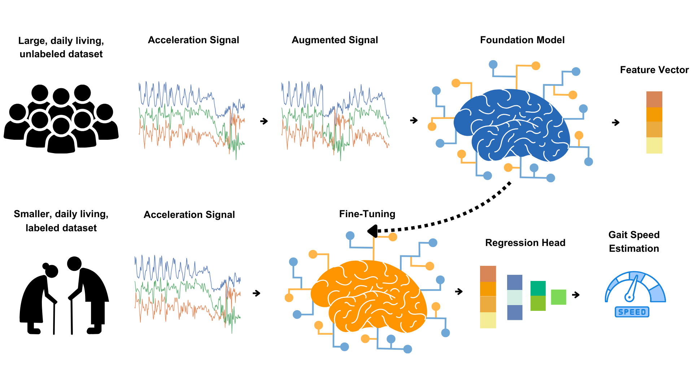

# ElderNet: Gait Quality Estimation for Older Adults



## Overview

This repository implements **ElderNet**, a deep learning model for estimating gait quality metrics from wrist-worn accelerometer data, optimized for older adults including those with impaired gait. The model uses self-supervised learning (SSL) pre-trained on UK Biobank data and is fine-tuned to predict four continuous gait metrics:

| Metric | Range | Description |
|--------|-------|-------------|
| **Gait Speed** | 0-2 m/s | Walking velocity |
| **Stride Length** | 0-2 m | Distance per stride |
| **Cadence** | 0-160 steps/min | Stepping rate |
| **Stride Regularity** | 0-1 | Gait consistency measure |

**Paper**: ["Continuous Assessment of Daily-Living Gait Using Self-Supervised Learning of Wrist-Worn Accelerometer Data"](https://www.medrxiv.org/content/10.1101/2025.05.21.25328061v1)

---

## Architecture

### Model Overview

ElderNet extends a ResNet-18 backbone with additional fully connected layers tailored for older adult gait analysis:

```
Input (3 x 300)                    # 10 sec @ 30 Hz, tri-axial accelerometer
    │
    ▼
┌─────────────────────────────┐
│  ResNet-18 Feature Extractor │   # Pre-trained on UK Biobank (SSL)
│  (1D Convolutional)          │   # Output: 1024-dim feature vector
└─────────────────────────────┘
    │
    ▼
┌─────────────────────────────┐
│  LinearLayers (3 FC layers)  │   # 1024 → 512 → 256 → 128
│  + Optional ReLU             │   # Adapted for older adults
└─────────────────────────────┘
    │
    ▼
┌─────────────────────────────┐
│  Task-Specific Head          │
│  - Regressor (continuous)    │   # Sigmoid activation scaled by max_mu
│  - Classifier (binary)       │   # For gait detection
└─────────────────────────────┘
    │
    ▼
Output: Gait Metric Prediction
```

### Key Components

| Component | Location | Description |
|-----------|----------|-------------|
| `Resnet` | `models.py:253` | 1D ResNet-18 backbone for accelerometer data |
| `ElderNet` | `models.py:608` | Wrapper adding FC layers to ResNet |
| `LinearLayers` | `models.py:130` | Three FC layers (1024→512→256→128) |
| `Regressor` | `models.py:73` | Regression head with sigmoid output scaled to metric range |
| `Classifier` | `models.py:63` | Binary classification head for gait detection |

### Pre-trained Weights

| File | Description |
|------|-------------|
| `weights/ssl_ukb_weights.mdl` | SSL pre-trained ResNet on UK Biobank |
| `weights/ssl_eldernet_weights.mdl` | SSL pre-trained ElderNet |
| `weights/gait_speed_weights.pt` | Fine-tuned gait speed model |
| `weights/gait_length_weights.pt` | Fine-tuned stride length model |
| `weights/cadence_weights.pt` | Fine-tuned cadence model |
| `weights/regularity_weights.pt` | Fine-tuned stride regularity model |
| `weights/gait_detection_weights.pt` | Fine-tuned gait/non-gait classifier |

---

## Installation

### Requirements

- Python 3.10
- CUDA 11.7 (optional, for GPU acceleration)

### Option 1: pip

```bash
git clone https://github.com/<username>/gait-quality.git
cd gait-quality
pip install -r requirements.txt
```

### Option 2: conda

```bash
git clone https://github.com/<username>/gait-quality.git
cd gait-quality
conda env create -f environment.yml
conda activate ElderNet
```

---

## Data Acquisition and Preparation

### Step 1: Download Mobilise-D Dataset

1. Download the dataset from [Zenodo (Record 13899386)](https://zenodo.org/records/13899386)
2. Extract all cohort folders to a local directory

**Expected directory structure:**
```
<DATA_ROOT>/
├── CHF/
│   ├── 2014/
│   │   └── Free-living/
│   │       └── data.mat
│   ├── 4023/
│   └── ...
├── COPD/
├── HA/
├── MS/
├── PD/
└── PFF/
```

### Step 2: Verify Participant Data

The following participant IDs have complete wrist sensor and reference gait data:

| Cohort | Participant IDs |
|--------|-----------------|
| **CHF** | 2014, 4023, 4025, 4028, 4029, 5003, 5008, 5012, 5015, 5019, 5020 |
| **COPD** | 1006, 1007, 1012, 1019, 1020, 1021, 1022, 1023, 1024, 1025, 1026, 1027, 1028, 1029, 2010, 2012, 2013 |
| **HA** | 1001, 1002, 1008, 1010, 1014, 1016, 1017, 1018, 3002, 3003, 3006, 3007, 3008, 3009, 4009, 5000 |
| **MS** | 2001, 2003, 2005, 2007, 2008, 2011, 3004, 3012, 3014, 4005, 4006, 4008, 4013, 4019 |
| **PD** | 1003, 1004, 1005, 1009, 1013, 1015, 3010, 3011, 4002, 4003, 4012, 4015, 4016, 4017, 4020 |
| **PFF** | 5001, 5004, 5005, 5006, 5007, 5009, 5010, 5014, 5016, 5017, 5018 |

> **Note**: Refer to `participant_information.xlsx` in the Zenodo download for demographic details.

### Step 3: Run Preprocessing Pipeline

Run the preprocessing script with your data path:

```bash
python data_parsing/MOBILISE_D_parsing.py --input /path/to/mobilise-d/data

# Optionally specify output directory:
python data_parsing/MOBILISE_D_parsing.py --input /path/to/data --output /path/to/output
```

**Output**: Creates `data_parsing/ten_seconds_windows_overlap_9sec_0.5nan_ratio/` with:
```
ten_seconds_windows_overlap_9sec_0.5nan_ratio/
├── Train/
│   ├── acc.p              # Acceleration windows (N, 3, 300)
│   ├── gait_speed.p       # Speed labels (N,)
│   ├── gait_length.p      # Stride length labels (N,)
│   ├── cadence.p          # Cadence labels (N,)
│   ├── regularity.p       # Regularity labels (N,)
│   └── subjects.p         # Subject IDs (N,)
└── Test/
    └── ... (same structure)
```

**Preprocessing Parameters** (from `MOBILISE_D_parsing.py`):
| Parameter | Value | Description |
|-----------|-------|-------------|
| `WIN_LENGTH` | 10 sec | Window duration |
| `OVERLAP` | 9 sec | Overlap between windows |
| `TARGET_FS` | 30 Hz | Resampling frequency |
| `TEST_SIZE` | 0.25 | Train/test split ratio |
| `NAN_RATIO` | 0.5 | Max allowed NaN ratio per window |

---

## Training

### Hyperparameter Tuning

Uses [Optuna](https://optuna.org/) with 5-fold stratified cross-validation:

```bash
# For gait speed (default)
python hyperparameter_tuning.py

# For other metrics, override config:
python hyperparameter_tuning.py data.labels=gait_length.p data.max_mu=2 data.measure="stride length"
python hyperparameter_tuning.py data.labels=cadence.p data.max_mu=160 data.measure="cadence"
python hyperparameter_tuning.py data.labels=regularity.p data.max_mu=1 data.measure="regularity"
```

**Hyperparameters searched**:
| Parameter | Search Space |
|-----------|--------------|
| Learning rate | [1e-5, 5e-5, 1e-4, 5e-4, 1e-3] |
| Batch size | [128, 256, 512] |
| Weight decay | [0, 0.01, 0.1] |
| Regressor layers | [0, 1, 2] |
| Batch normalization | [True, False] |

**Output**: Best model checkpoint saved to `outputs/<metric>/.../<timestamp>/best_model.pt`

**Note**: The number of Optuna trials is set to 50 by default. Adjust via `model.num_trials=<N>` for more thorough search.

### Final Training

After hyperparameter tuning, train on the full training set:

```bash
# Update config_final_training.yaml with best hyperparameters, then:
python final_training.py
```

After tuning completes, update `conf/config_final_training.yaml` with the best hyperparameters from the log output:
```yaml
model:
  lr: <best_lr>
  batch_size: <best_batch_size>
  wd: <best_weight_decay>
  num_layers_regressor: <best_num_layers>
  batch_norm: <best_batch_norm>
```

---

## Evaluation / Inference

### Using Pre-trained Weights

Run inference with pre-trained weights:
```bash
python inference.py model.weights_path=weights/gait_speed_weights.pt
```

### Evaluate Your Trained Model

```bash
python inference.py \
    model.weights_path=outputs/gait_speed/.../final_training/final_model.pt \
    data.data_root=data_parsing/ten_seconds_windows_overlap_9sec_0.5nan_ratio/Test
```

**Metrics Reported**:
- MAE (Mean Absolute Error)
- RMSE (Root Mean Square Error)
- MAPE (Mean Absolute Percentage Error)
- R² (Coefficient of Determination)
- ICC (Intraclass Correlation Coefficient)

---

## Daily Living Analysis (RUSH Pipeline)

For analyzing real-world wearable data, specify the data paths via command line:

```bash
python RUSH/rush_pipeline.py \
    data.data_path=/path/to/accelerometer/data \
    data.log_path=/path/to/output \
    data.output_filename=results.csv \
    sensor_device=Axivity  # or GENEActive
```

**Supported Sensors**:
- Axivity AX3/AX6 (default)
- GENEActiv

**Output CSV includes**:
- Daily walking time (minutes)
- Daily step count
- Gait speed statistics (median, mean, std, percentiles)
- Cadence statistics
- Stride length statistics
- Stride regularity statistics
- Bout duration statistics

---

## Repository Structure

```
gait-quality/
├── conf/                           # Hydra configuration files
│   ├── config_hyp.yaml             # Hyperparameter tuning config
│   ├── config_final_training.yaml  # Final training config
│   ├── config_inference.yaml       # Inference config
│   ├── config_rush.yaml            # RUSH pipeline config
│   ├── models_config.txt           # Best model configurations
│   ├── model/                      # Model architecture configs
│   ├── dataloader/                 # Data loading configs
│   └── augmentation/               # Augmentation configs
├── data_parsing/
│   └── MOBILISE_D_parsing.py       # Preprocessing script
├── dataset/
│   ├── dataloader.py               # PyTorch datasets
│   └── transformations.py          # Data augmentations
├── RUSH/
│   └── rush_pipeline.py            # Daily living analysis
├── weights/                        # Pre-trained model weights
├── models.py                       # Neural network architectures
├── utils.py                        # Utility functions
├── regularity.py                   # Stride regularity calculation
├── hyperparameter_tuning.py        # Optuna-based tuning
├── final_training.py               # Final model training
├── inference.py                    # Model evaluation
├── requirements.txt                # pip dependencies
└── environment.yml                 # conda environment
```

---

## Reproducibility

All random seeds are set for reproducibility:
- **Seed value**: 42
- **Libraries seeded**: Python `random`, NumPy, PyTorch, CUDA

To ensure identical results:
```python
from utils import set_seed
set_seed(42)
```

---

## Citation

If you use this code or ElderNet in your research, please cite:

```bibtex
@article{Brand2025Gait,
  title={Continuous Assessment of Daily-Living Gait Using Self-Supervised Learning of Wrist-Worn Accelerometer Data},
  author={Brand, Yonatan E and Buchman, Aron S and Kluge, Felix and Palmerini, Luca and Becker, Clemens and Cereatti, Andrea and Maetzler, Walter and Vereijken, Beatrix and Yarnall, Alison J and Rochester, Lynn and Del Din, Silvia and Mueller, Arne and Hausdorff, Jeffrey M and Perlman, Or},
  journal={medRxiv},
  year={2025},
  note={Preprint},
  doi={10.1101/2025.05.21.25328061},
  url={https://pmc.ncbi.nlm.nih.gov/articles/PMC12140532/}
}
```

---

## License

University of Oxford Academic Use License. See [LICENSE.md](LICENSE.md) for details.

Based on [ssl-wearables](https://github.com/OxWearables/ssl-wearables) from OxWearables.
